<p align="center">
  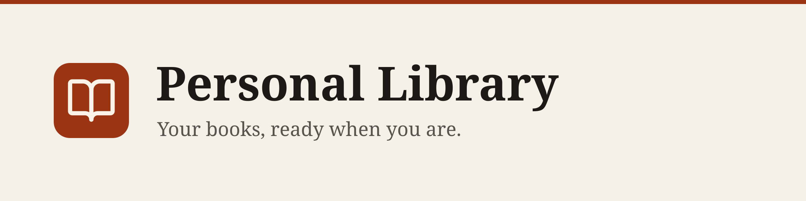
</p>

<p align="center">
  
  
  
  
  
  
  
  
  
</p>

# Personal Library

A local full-stack personal library for uploading, organizing, and reading PDF books. It is scoped to the core flow: create an account, verify the email, log in, upload a PDF, manage its metadata, and read it in the browser.

## Stack

| Service | Technology | Responsibility |
| --- | --- | --- |
| `web` | Next.js | Client-side interface only |
| `auth` | Hono + Better Auth | Accounts, email flows, password hashing, JWTs |
| `api` | Python + FastAPI | Library API, authorization, uploads, reads |
| `postgres` | PostgreSQL | Durable auth and library metadata |
| `redis` | Redis | Per-user library-list cache |
| `minio` | MinIO | PDF object storage |
| `mailpit` | Mailpit | Local SMTP inbox for verification and reset emails |

## Architecture

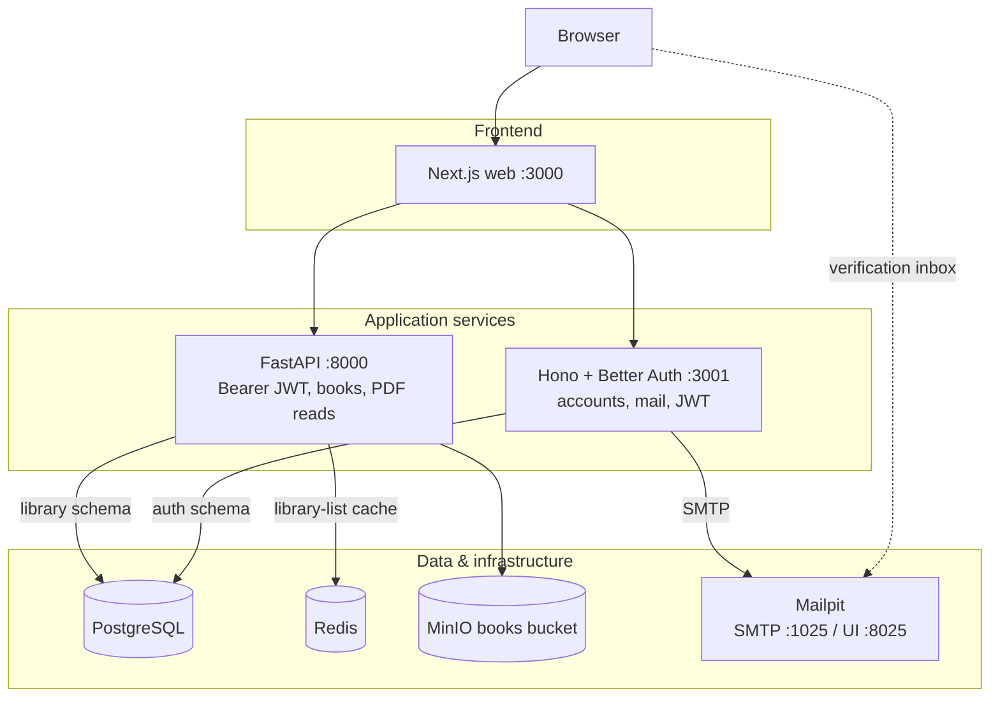

PostgreSQL is shared as a server only. Better Auth owns the `auth` schema; FastAPI owns the `library` schema and never writes Better Auth's tables.

## Screens

<table>
  <tr>
    <td width="50%">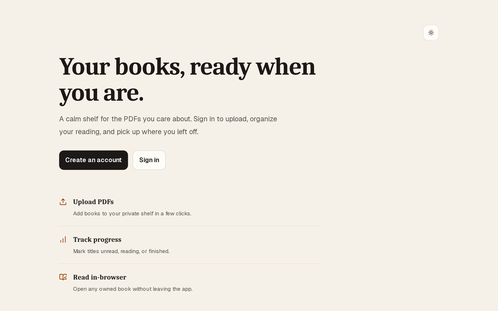<br><em>Landing</em></td>
    <td width="50%">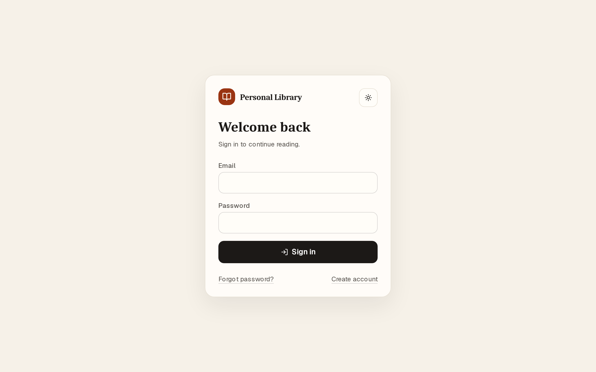<br><em>Sign in</em></td>
  </tr>
  <tr>
    <td>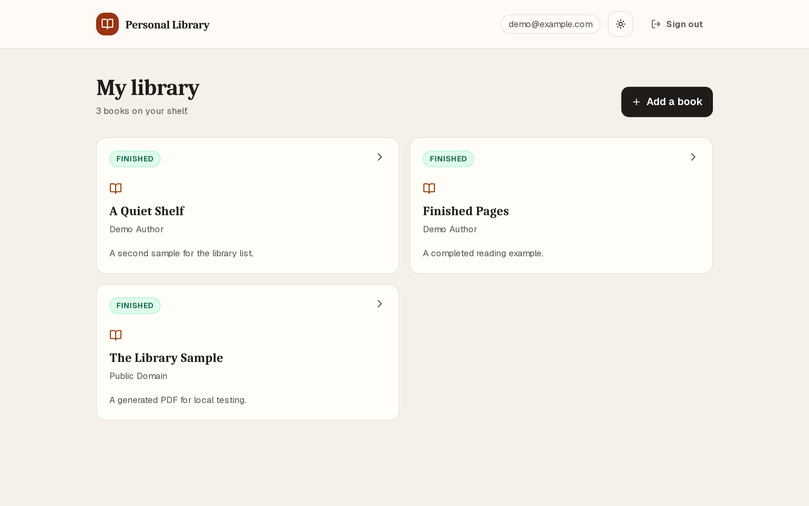<br><em>Library</em></td>
    <td>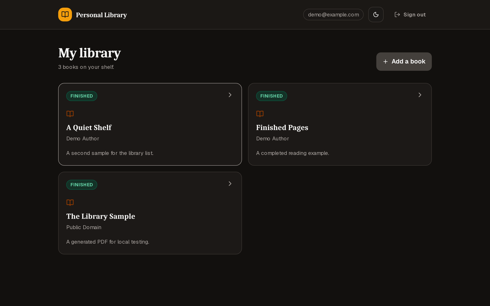<br><em>Library (dark)</em></td>
  </tr>
  <tr>
    <td>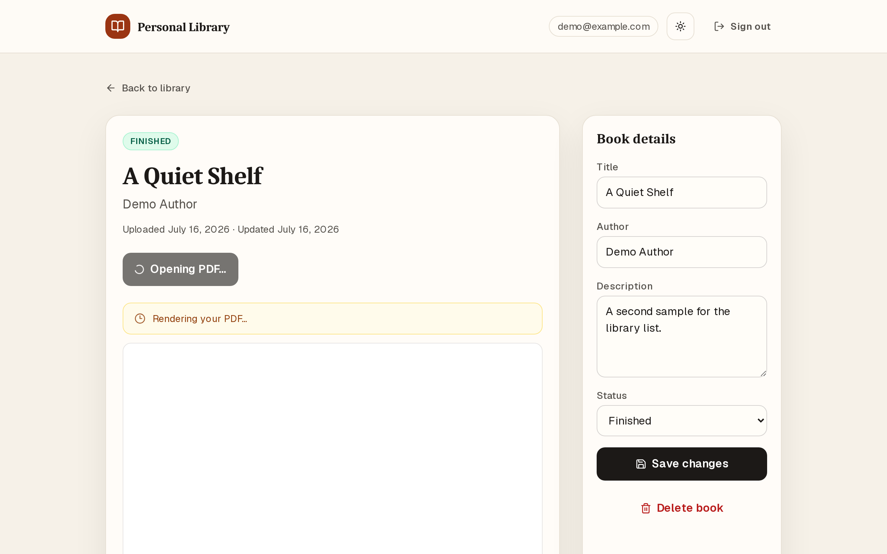<br><em>Book detail &amp; reader</em></td>
    <td>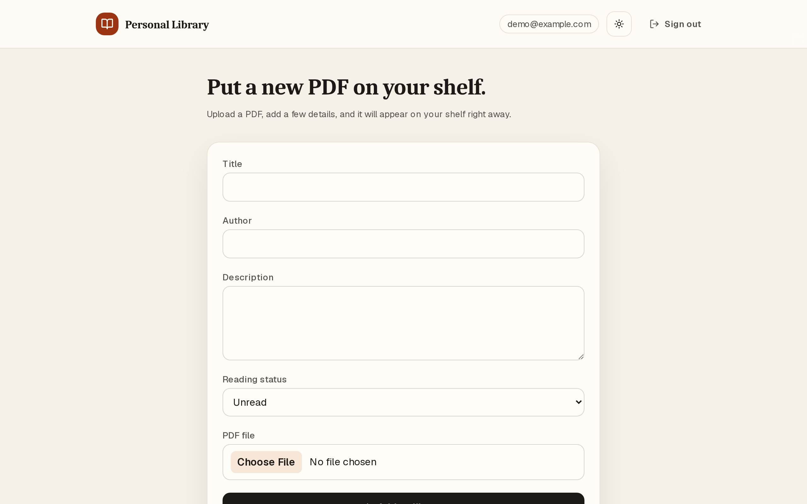<br><em>Add a book</em></td>
  </tr>
  <tr>
    <td colspan="2">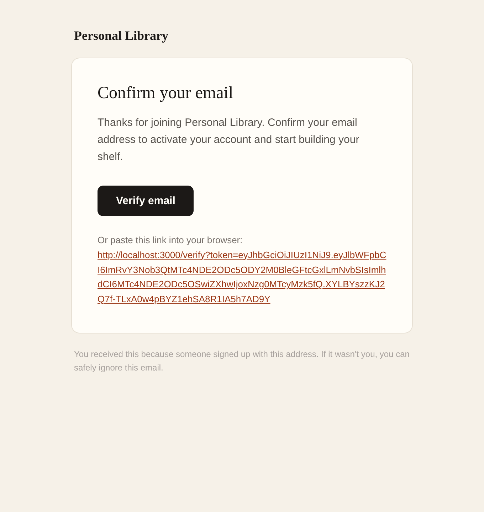<br><em>Verification email (Mailpit)</em></td>
  </tr>
</table>

## Run locally

Prerequisites: Docker Desktop or Docker Engine with Docker Compose.

```sh
cp .env.example .env
docker compose up --build
```

The auth container runs Better Auth's database migration during startup. The FastAPI container creates the `library.books` table and the MinIO `books` bucket during startup.

In a second terminal, add deterministic demo data:

```sh
docker compose exec api python -m app.seed
```

The seeder uses the auth service's HTTP API, completes its verification email through Mailpit, then creates a verified demo user, three books, and generated one-page sample PDFs in MinIO. It can be run repeatedly; it replaces that user's sample books instead of accumulating duplicates.

To stop the stack:

```sh
docker compose down
```

To also remove local database and object-storage data:

```sh
docker compose down --volumes
```

## Local URLs and demo account

| Service | URL |
| --- | --- |
| Frontend | http://localhost:3000 |
| FastAPI OpenAPI docs | http://localhost:8000/docs |
| Auth service | http://localhost:3001 |
| Mailpit inbox | http://localhost:8025 |
| MinIO API | http://localhost:9000 |
| MinIO console | http://localhost:9001 |

After seeding:

```text
Email:    demo@example.com
Password: password123
```

## Email flows

### Verification

1. Open the frontend and sign up with an email and password.
2. Open Mailpit at http://localhost:8025.
3. Open the **Verify your Library email** message and click the verification link.
4. The link opens the app at `/verify`, confirms your account, and signs you in.

### Password reset

1. On the login page, choose **Forgot password?**.
2. Submit the account email.
3. In Mailpit, open the **Reset your Library password** message and follow the link.
4. Enter a new password on the reset page, then log in.

Mailpit speaks SMTP on port 1025, so the auth service uses the same email delivery protocol it would use against an external SMTP provider. Mailpit captures messages locally instead of delivering them to a real inbox.

## Authentication and authorization

Better Auth runs only in the standalone Hono service. It handles registration, email/password login, password hashing, verification, reset emails, password reset, and JWT issuance. The browser keeps the Better Auth session cookie for the auth service, retrieves a JWT through Better Auth's JWT plugin, and keeps that token in client memory.

Requests to FastAPI include `Authorization: Bearer <JWT>`. FastAPI retrieves the signing key from the auth service's JWKS endpoint, verifies the EdDSA signature plus issuer and audience, and uses the JWT `sub` claim as the stable user ID.

Every query that finds, changes, deletes, or streams a book requires both its book ID and that authenticated user ID. A guessed book ID belonging to another user returns `404` and never exposes its metadata or file.

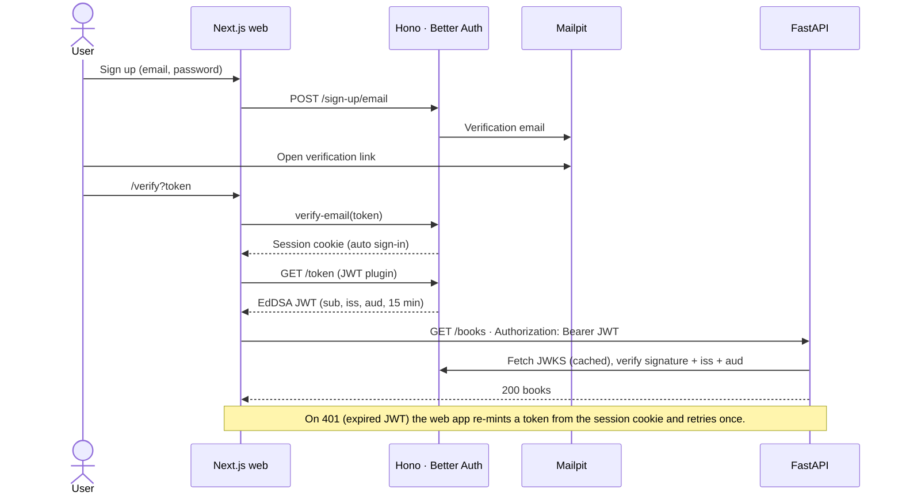

## Library API

All book endpoints require a bearer token except `/health`.

| Method | Endpoint | Purpose |
| --- | --- | --- |
| `GET` | `/health` | Service health |
| `GET` | `/books` | List the current user's books |
| `POST` | `/books` | Upload PDF and create metadata |
| `GET` | `/books/{book_id}` | Get one owned book |
| `PATCH` | `/books/{book_id}` | Change metadata or reading status |
| `DELETE` | `/books/{book_id}` | Remove an owned book and its PDF |
| `GET` | `/books/{book_id}/read-url` | Get the protected reader route |
| `GET` | `/books/{book_id}/content` | Stream the owned PDF |

`POST /books` is multipart form data with `title`, `author`, optional `description`, optional `reading_status`, and `file`. The API accepts PDFs up to 25 MB. Reading status is `unread`, `reading`, or `finished`.

## Storage decisions

Book metadata lives in PostgreSQL. PDF bytes live in the private MinIO `books` bucket under a key containing the owner ID and book ID.

The API streams PDFs after authorizing the requesting user rather than exposing public object URLs. The frontend fetches that stream with its bearer token, creates a browser Blob URL, and displays it in an iframe. This keeps MinIO credentials and object paths out of the browser while allowing the browser's native PDF reader to render the file.

Redis caches `GET /books` for each user under `library:books:<user-id>` for 60 seconds. Creating, editing, or deleting a book deletes that user's cache key, so the next list request reads fresh PostgreSQL data. This is a bounded cache with explicit invalidation.

## Data model

Better Auth owns the `auth` schema; FastAPI owns `library.books` and never writes the auth tables. The link is logical: `library.books.user_id` holds the JWT `sub` (the Better Auth user id).

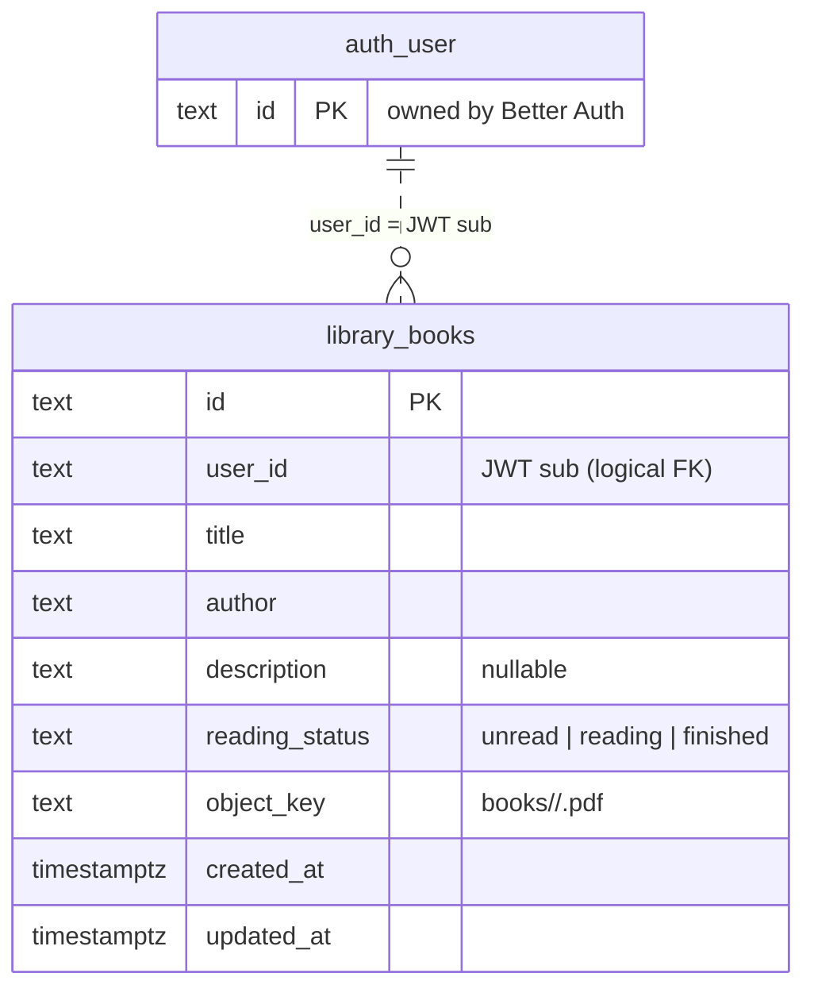

## Configuration

Copy `.env.example` to `.env`. Compose reads every credential from `.env` and fails fast if one is missing; no secret values live in `compose.yaml`. These are safe local defaults; replace the two secrets before sharing the environment.

| Variable | Purpose |
| --- | --- |
| `POSTGRES_DB` | PostgreSQL database name |
| `POSTGRES_USER` | PostgreSQL user |
| `POSTGRES_PASSWORD` | PostgreSQL password |
| `BETTER_AUTH_SECRET` | Secret used by Better Auth; use at least 32 random bytes |
| `MINIO_ROOT_USER` | Local MinIO access key |
| `MINIO_ROOT_PASSWORD` | Local MinIO secret key |

For example, generate a Better Auth secret with:

```sh
openssl rand -base64 32
```

## Verification performed

The local stack was exercised with:

```sh
docker compose up --build
docker compose exec api python -m app.seed
./scripts/e2e-check.sh
cd scripts/ui-e2e && npm install && npx playwright install chromium && npm run walkthrough
```

The E2E script checks all seven services, auth flows (signup, verify, login, reset), library CRUD, PDF streaming, Redis caching, user isolation, and confirms the Next.js app has no API routes. The Playwright walkthrough covers the same flows in a real browser (login, PDF iframe, signup verification, password reset).

## Optional features implemented

Beyond the required core flow, this build includes:

- Responsive UI polish with dark mode, loading skeletons, and empty states
- In-app email verification at `/verify?token=...` with links routed through the web app
- Password reset pending screens with Mailpit instructions
- Route-specific page titles and social metadata

Not implemented: unit or integration test suites, CI, EPUB support, search, tags, reading progress, or PDF.js controls. End-to-end coverage is provided by `scripts/e2e-check.sh` and the Playwright walkthrough (see [Verification performed](#verification-performed)) rather than a unit-test suite.

## How this was built (Cursor skills)

**[Hallmark](https://github.com/Nutlope/hallmark)** (UI), **[no-ai-slop](https://github.com/realrossmanngroup/no_ai_slop_writing_rules)** (Rossmann prose), and **fuck-slop** (text pass), plus E2E/Playwright verification. Full credits: **[docs/skills.md](docs/skills.md)**.

## Intentional limits

- The app supports PDF files only; EPUB, annotations, search, and progress tracking are out of scope.
- Uploads are read into FastAPI memory and capped at 25 MB, which is suitable for this local take-home scope rather than large-file production uploads.
- The local Compose configuration uses HTTP, local credentials, and Mailpit; production deployment would require TLS, managed secrets, persistent backups, and observability.
- The Next.js app is frontend-only: no API routes, server actions, or auth middleware. All business logic lives in the Hono auth service or FastAPI backend.
